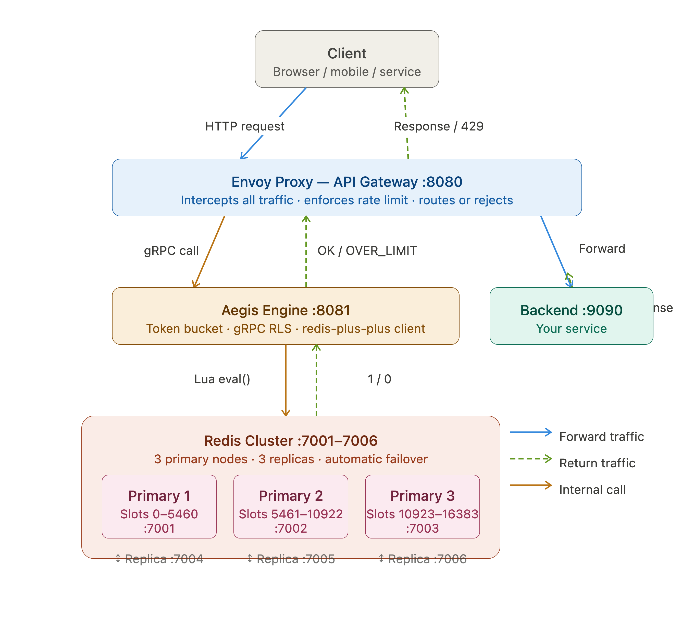

# Aegis Engine

**Envoy API Gateway with Custom Token Bucket Rate Limiting, redis-plus-plus Client, and Redis Cluster High Availability**

| | |
|---|---|
| **Status** | Draft |
| **Reviewers** | Engineering, Architecture, Platform |
| **Last Updated** | June 2026 |
| **Version** | 2.0 |
| **Changes from v1.0** | Added Redis Cluster topology, redis-plus-plus client, cluster failover, Bazel `local_path_override` setup |

---

## Table of Contents

1. [Overview](#1-overview)
2. [Goals & Non-Goals](#2-goals--non-goals)
3. [System Architecture](#3-system-architecture)
4. [Request Flow](#4-request-flow)
5. [Rate Limiting Algorithm](#5-rate-limiting-algorithm)
6. [redis-plus-plus Client](#6-redis-plus-plus-client)
7. [Redis Cluster](#7-redis-cluster)
8. [Envoy Integration](#8-envoy-integration)
9. [Build System](#9-build-system)
10. [Deployment](#10-deployment)
11. [Testing](#11-testing)
12. [Future Work](#12-future-work)
13. [Glossary](#13-glossary)

---

## 1. Overview

Aegis Engine is a distributed rate limiting service built in C++ that integrates with Envoy Proxy as an API Gateway. Rather than relying on Envoy's built-in rate limiting, Aegis Engine implements a custom Token Bucket algorithm backed by a Redis Cluster, exposed to Envoy via the gRPC-based External Rate Limit Service (RLS) protocol.

This version (v2.0) updates the design to reflect the decision to use **redis-plus-plus** as the Redis client library, which provides built-in Redis Cluster support including automatic slot routing, MOVED/ASK redirect handling, and connection pooling across all cluster nodes. This replaces the previously described plain hiredis approach.

---

## 2. Goals & Non-Goals

### 2.1 Goals

- Enforce distributed rate limits consistently across multiple application servers.
- Implement the Token Bucket algorithm with atomic Redis-backed Lua scripting.
- Integrate with Envoy Proxy via the standard External RLS gRPC protocol.
- Support pluggable rate limiting algorithms (Leaky Bucket, Sliding Window) via a common abstract interface.
- Achieve high availability via Redis Cluster with 3 primary nodes and 3 replicas and automatic failover.
- Use redis-plus-plus as the Redis client for built-in cluster-aware routing.
- Build with reproducible Bazel builds using Bzlmod and C++17.

### 2.2 Non-Goals

- Aegis Engine does not implement authentication or authorization.
- Aegis Engine does not handle TLS termination — that is Envoy's responsibility.
- This document does not cover the backend services behind the API gateway.

---

## 3. System Architecture

The system is composed of four layers that work together to intercept, evaluate, and enforce rate limits on every incoming request.



### 3.1 Component Summary

| Component | Technology | Responsibility |
|---|---|---|
| API Gateway | Envoy Proxy | Intercepts all traffic, calls Aegis Engine via gRPC before routing |
| Rate Limiter | C++ / Aegis Engine | Implements RLS gRPC interface, applies token bucket logic |
| Redis Client | redis-plus-plus | Cluster-aware C++ client — slot routing, MOVED/ASK, connection pooling |
| Token Store | Redis Cluster | 6-node cluster storing token counts atomically per IP key |
| Algorithm | Token Bucket + Lua | Atomic refill-and-consume via Redis Lua scripting |
| Build System | Bazel + Bzlmod | Reproducible builds, `local_path_override` for redis-plus-plus |

---

## 4. Request Flow

The following steps describe the lifecycle of a single incoming request through the system:

1. Client sends an HTTP request to Envoy on port 8080.
2. Envoy's `ratelimit` HTTP filter intercepts the request before routing.
3. Envoy calls Aegis Engine's `ShouldRateLimit()` gRPC method with a descriptor containing the client's `remote_address` (IP).
4. Aegis Engine's `grpc_server.cpp` extracts the IP from the descriptor and constructs a Redis key: `"ip:203.0.113.42:tokens"`.
5. Aegis Engine calls `execute_consume_script()` which invokes `cluster_.eval()` from redis-plus-plus.
6. redis-plus-plus computes the CRC16 hash slot for the key, looks up the owning primary node, and routes the EVAL command to that specific node automatically.
7. The Lua script runs atomically on the Redis primary node: reads `tokens` and `last_refill`, calculates elapsed time, refills tokens, attempts to consume. Returns `1` (allowed) or `0` (denied).
8. Aegis Engine receives the result and sets the gRPC response: `Code::OK` or `Code::OVER_LIMIT`.
9. If `OK`: Envoy routes the request to the backend. If `OVER_LIMIT`: Envoy returns HTTP `429 Too Many Requests` with `X-RateLimit-RetryAfter` header.

---

## 5. Rate Limiting Algorithm

### 5.1 Abstract Interface

All rate limiting algorithms implement the `RateLimiter` abstract base class, allowing Aegis Engine to swap algorithms without changing the gRPC server or any other component:

```cpp
class RateLimiter {
public:
    virtual bool   consume(double tokens = 1.0)          = 0;
    virtual void   consume_blocking(double tokens = 1.0) = 0;
    virtual double available()                           = 0;
    virtual ~RateLimiter() = default;
};
```

### 5.2 Token Bucket Algorithm

The Token Bucket algorithm allows short bursts up to a configured capacity, then refills at a steady rate. It is the primary algorithm used in production.

| Parameter | Description | Example |
|---|---|---|
| `capacity` | Maximum tokens the bucket can hold | 100 tokens |
| `refill_rate` | Tokens added per second | 10 tokens/sec |
| `tokens` | Current available token count stored in Redis | 74.3 tokens |
| `last_refill` | Unix timestamp of last refill calculation | 1717000000.123 |

### 5.3 Atomic Lua Script

The consume operation is performed via a Lua script executed atomically on the Redis primary node. While the script runs, no other Redis command from any server can interleave — preventing race conditions across multiple Aegis Engine instances.

```lua
-- KEYS[1] = 'ip:203.0.113.42:tokens'
-- ARGV: capacity, refill_rate, tokens_requested, now

local stored_tokens = redis.call('HGET', key, 'tokens')
local stored_last   = redis.call('HGET', key, 'last_refill')

local tokens      = stored_tokens and tonumber(stored_tokens) or capacity
local last_refill = stored_last   and tonumber(stored_last)   or now

-- Refill: add tokens proportional to elapsed time
local elapsed = now - last_refill
tokens = math.min(capacity, tokens + (elapsed * refill_rate))

if tokens >= tokens_req then
    tokens = tokens - tokens_req
    redis.call('HSET', key, 'tokens', tokens)
    redis.call('HSET', key, 'last_refill', now)
    redis.call('EXPIRE', key, 3600)
    return 1   -- ALLOWED
else
    redis.call('HSET', key, 'tokens', tokens)
    redis.call('HSET', key, 'last_refill', now)
    return 0   -- DENIED
end
```

### 5.4 Redis Key Design

Only two fields are stored per key — everything else is configuration that lives in C++ code:

| Data | Stored Where | Why |
|---|---|---|
| `tokens` | Redis HSET field | Changes on every request — must be shared across servers |
| `last_refill` | Redis HSET field | Needed to calculate elapsed time for refill in Lua |
| `capacity` | C++ code | Static config — same for all requests, no reason to persist |
| `refill_rate` | C++ code | Static config — same for all requests, no reason to persist |
| TTL (`EXPIRE`) | Redis EXPIRE | Auto-cleanup inactive IP keys after 1 hour |

Key naming follows a namespace convention to support different rate limit scopes:

```
ip:{ip_address}:tokens                     // per IP  (current implementation)
user:{user_id}:tokens                      // per user
user:{user_id}:endpoint:{path}:tokens      // per user per endpoint
```

### 5.5 Supported Algorithms

| Algorithm | Burst Behaviour | Best For | Status |
|---|---|---|---|
| Token Bucket | Allows bursts up to capacity | APIs with occasional bursts | ✅ Implemented |
| Leaky Bucket | No bursts, fixed output rate | Smooth, predictable throughput | 🔲 Planned |
| Sliding Window | Max N requests per time window | Strict request count enforcement | 🔲 Planned |

---

## 6. redis-plus-plus Client

### 6.1 Why redis-plus-plus

Plain hiredis was evaluated first but does not support Redis Cluster — it only connects to a single node. Implementing cluster support manually (CRC16 slot calculation, CLUSTER SLOTS topology discovery, MOVED/ASK redirect handling, connection pooling) would require significant custom code with ongoing maintenance risk.

redis-plus-plus provides all of this as a built-in C++ wrapper around hiredis:

| Concern | Plain hiredis (manual) | redis-plus-plus `RedisCluster` |
|---|---|---|
| CRC16 slot calculation | You implement it | Built in |
| CLUSTER SLOTS topology | You implement it | Built in, automatic on connect |
| MOVED redirect handling | You implement it | Built in, transparent |
| ASK redirect (slot migration) | You implement it | Built in |
| Per-node connection pooling | You implement it | Built in |
| Bazel Central Registry | ✅ Available | ❌ Not available — `local_path_override` |
| API style | C structs, manual | Modern C++, type-safe |

### 6.2 How RedisCluster Routes Requests

When `execute_consume_script()` calls `cluster_.eval()`, redis-plus-plus internally performs the following steps transparently:

1. Computes the CRC16 hash of the key (e.g. `"ip:203.0.113.42:tokens"`) to determine the hash slot (0–16383).
2. Looks up which primary node owns that slot in its cached slot map.
3. Sends the EVAL command directly to that specific node's connection.
4. If the node returns a `MOVED` error (e.g. after a failover), refreshes the slot map and retries automatically.
5. If the node returns an `ASK` error (e.g. during a live slot migration), follows the redirect transparently.

From the perspective of `RedisTokenBucket`, this entire process is a single blocking call:

```cpp
// redis-plus-plus handles all routing internally
long long result = cluster_.eval<long long>(
    CONSUME_SCRIPT,
    { key_ },                    // KEYS — used to determine the slot
    { capacity, refill_rate,
      tokens_requested, now }    // ARGV
);
```

### 6.3 Connection and Destructor

Unlike plain hiredis which required a manual `connect()` method and an explicit destructor to call `redisFree()`, redis-plus-plus manages both automatically:

```cpp
RedisTokenBucket::RedisTokenBucket(
    const std::string& key,
    double capacity,
    double refill_rate,
    const std::string& cluster_uri)
    : key_(key),
      capacity_(capacity),
      refill_rate_(refill_rate),
      cluster_(cluster_uri)   // connects + discovers topology HERE
{
    // cluster_ is already connected by the time we reach this body
}

// No destructor needed — RedisCluster's own destructor
// closes all pooled connections automatically when
// RedisTokenBucket goes out of scope.
```

---

## 7. Redis Cluster

### 7.1 Topology

Redis Cluster is deployed as 6 Docker containers — 3 primary nodes and 3 replicas. Each primary owns a shard of the 16,384 hash slots. Keys are deterministically assigned to a slot via CRC16, and each slot is owned by exactly one primary at any time.

| Container | Role | IP Address | Host Port | Hash Slots |
|---|---|---|---|---|
| redis-node-1 | Primary | 172.20.0.11 | 7001 | 0 – 5460 |
| redis-node-2 | Primary | 172.20.0.12 | 7002 | 5461 – 10922 |
| redis-node-3 | Primary | 172.20.0.13 | 7003 | 10923 – 16383 |
| redis-node-4 | Replica | 172.20.0.14 | 7004 | Mirrors redis-node-1 |
| redis-node-5 | Replica | 172.20.0.15 | 7005 | Mirrors redis-node-2 |
| redis-node-6 | Replica | 172.20.0.16 | 7006 | Mirrors redis-node-3 |

### 7.2 Cluster Bootstrap

The cluster is initialised by a one-shot `redis-cluster-init` container in Docker Compose that runs `CLUSTER CREATE` after all 6 nodes are healthy:

```bash
redis-cli --cluster create \
    172.20.0.11:6379  172.20.0.12:6379  172.20.0.13:6379 \
    172.20.0.14:6379  172.20.0.15:6379  172.20.0.16:6379 \
    --cluster-replicas 1 --cluster-yes
```

### 7.3 Failover Behaviour

When a primary node fails, Redis Cluster's internal gossip protocol detects the failure and promotes the corresponding replica automatically. The sequence is:

1. Primary node (e.g. redis-node-1) stops responding.
2. Remaining nodes detect failure via gossip within `cluster-node-timeout` (default 5 seconds).
3. The replica for the failed primary (redis-node-4) is promoted to primary.
4. redis-plus-plus receives a `MOVED` error on the next command to the failed node.
5. redis-plus-plus automatically re-fetches `CLUSTER SLOTS`, updates its slot map, and retries the command against the newly promoted node.
6. Your C++ code sees no error — the retry is transparent.

During the failover window (up to 5 seconds), commands to the affected slot range may fail. Aegis Engine handles this by failing open:

```cpp
catch (const sw::redis::Error& e) {
    std::cerr << "[token_bucket] Cluster error: " << e.what()
              << " -- failing open\n";
    return true;   // allow request if Redis is temporarily unreachable
}
```

### 7.4 Docker Network Configuration

All 6 Redis nodes run on a dedicated Docker bridge network with fixed IP addresses. Fixed IPs are critical because Redis Cluster nodes store each other's addresses in their cluster config — if IPs changed on restart, nodes would lose track of each other.

```yaml
networks:
  redis-cluster-network:
    driver: bridge
    ipam:
      config:
        - subnet: 172.20.0.0/16   # 65,534 available addresses
```

### 7.5 Graceful Shutdown

| Command | Stops | Removes Containers | Removes Data |
|---|---|---|---|
| `docker compose stop --timeout 30` | Yes | No | No — data preserved on volumes |
| `docker compose down` | Yes | Yes | No — data preserved on volumes |
| `docker compose down -v` | Yes | Yes | Yes — full reset |

---

## 8. Envoy Integration

### 8.1 External Rate Limit Service Protocol

Envoy communicates with Aegis Engine using the standard External RLS gRPC protocol. The `.proto` file is downloaded from Envoy's official GitHub repository and compiled with `protoc` at build time via Bazel's `cpp_grpc_library` rule. Aegis Engine implements the `ShouldRateLimit` RPC:

```protobuf
service RateLimitService {
    rpc ShouldRateLimit(RateLimitRequest)
        returns (RateLimitResponse);
}
```

### 8.2 IP-Based Rate Limiting

Envoy extracts the client's IP address using the `remote_address` action and sends it as a descriptor to Aegis Engine:

```yaml
# envoy.yaml
rate_limits:
  - actions:
      - remote_address: {}   # sends { key: 'remote_address', value: '203.0.113.42' }
```

Aegis Engine's gRPC server unpacks the descriptor and builds the Redis key:

```cpp
std::string extract_ip(const RateLimitRequest* request) {
    for (const auto& descriptor : request->descriptors())
        for (const auto& entry : descriptor.entries())
            if (entry.key() == "remote_address")
                return entry.value();   // "203.0.113.42"
    return "";
}

std::string build_key(const std::string& ip) {
    return "ip:" + ip + ":tokens";   // "ip:203.0.113.42:tokens"
}
```

### 8.3 Response Construction

Aegis Engine constructs the gRPC response back to Envoy with the rate limit decision and optional headers:

```cpp
if (allowed) {
    response->set_overall_code(Code::OK);
} else {
    response->set_overall_code(Code::OVER_LIMIT);
    // tell the client when to retry
    auto* header = response->add_response_headers_to_add();
    header->mutable_header()->set_key("X-RateLimit-RetryAfter");
    header->mutable_header()->set_value("1");
}
```

### 8.4 Envoy Failure Mode

If Aegis Engine is unreachable, Envoy's behaviour is controlled by `failure_mode_deny` in `envoy.yaml`. This is set to `false` (fail open) so a brief Aegis outage does not take down the entire API:

```yaml
failure_mode_deny: false   # false = fail open (allow), true = fail closed (deny all)
```

---

## 9. Build System

### 9.1 Bazel with Bzlmod

The project uses Bazel 8 with Bzlmod (`MODULE.bazel`) for dependency management. `WORKSPACE` is kept but left empty as per Bazel 8 defaults.

### 9.2 Dependencies

| Dependency | Version | In BCR? | Purpose |
|---|---|---|---|
| `rules_cc` | 0.0.9 | ✅ Yes | C++ build rules |
| `googletest` | 1.14.0 | ✅ Yes | Unit testing framework |
| `hiredis` | 1.3.0 | ✅ Yes | Redis C client (redis-plus-plus depends on it) |
| `redis-plus-plus` | latest | ❌ No | Cluster-aware C++ Redis client — `local_path_override` |
| `gRPC` | latest | ✅ Yes | RLS protocol transport |
| `protobuf` | latest | ✅ Yes | Serialization for gRPC messages |

### 9.3 redis-plus-plus Bazel Integration

Since redis-plus-plus is not in the Bazel Central Registry, it is built from source and integrated via `local_path_override` in `MODULE.bazel`. The `third_party` directory must live next to `MODULE.bazel` (the Bazel workspace root):

```
aegis-engine/                          ← Bazel workspace root
├── MODULE.bazel
├── WORKSPACE                          ← kept empty
├── BUILD
├── third_party/
│   └── redis_plus_plus/
│       ├── MODULE.bazel               ← module(name = "redis_plus_plus")
│       ├── BUILD.bazel                ← cc_library pointing to installed .a
│       ├── include/sw/                ← symlink to /usr/local/include/sw
│       └── lib/libredis++.a           ← symlink to /usr/local/lib/libredis++.a
└── *.h / *.cpp
```

`MODULE.bazel`:

```python
module(name = "my_project", version = "1.0")

bazel_dep(name = "rules_cc",    version = "0.0.9")
bazel_dep(name = "googletest",  version = "1.14.0")
bazel_dep(name = "hiredis",     version = "1.3.0")
bazel_dep(name = "redis_plus_plus")

local_path_override(
    module_name = "redis_plus_plus",
    path        = "third_party/redis_plus_plus",
)
```

### 9.4 Build Commands

```bash
# install redis-plus-plus from source (run once on each machine)
git clone https://github.com/sewenew/redis-plus-plus.git
cd redis-plus-plus && mkdir build && cd build
cmake .. -DCMAKE_PREFIX_PATH=$(brew --prefix hiredis) \
         -DREDIS_PLUS_PLUS_BUILD_TEST=OFF
make && sudo make install

# build the Aegis Engine binary
bazel build //aegis-engine:main

# run unit tests
bazel test //aegis-engine:token_bucket_test --test_output=all

# build everything
bazel build //...
```

---

## 10. Deployment

### 10.1 Docker Compose Services

| Service | Image | Port | Depends On |
|---|---|---|---|
| `envoy` | `envoyproxy/envoy:v1.29` | 8080 (traffic), 9901 (admin) | `aegis-engine` |
| `aegis-engine` | Custom C++ Docker build | 8081 (gRPC) | `redis-node-1..3` |
| `redis-node-1..6` | `redis:8.8.0` | 7001–7006 | — |
| `redis-cluster-init` | `redis:8.8.0` | — | All 6 nodes |
| `backend` | Your backend service | 9090 | — |

### 10.2 VM Deployment via Docker

Since redis-plus-plus is not in the Bazel Central Registry, it must be built from source on each machine before running the Bazel build. For VM deployments, this is handled in a multi-stage Dockerfile so the VM itself only needs Docker installed:

```dockerfile
# Stage 1 — build redis-plus-plus and compile Aegis Engine
FROM ubuntu:22.04 AS builder
RUN apt-get install -y build-essential cmake git libhiredis-dev
RUN git clone https://github.com/sewenew/redis-plus-plus.git \
    && cd redis-plus-plus/build \
    && cmake .. && make && make install && ldconfig
COPY . /app
RUN bazel build //aegis-engine:main --config=opt

# Stage 2 — minimal runtime image (no build toolchain)
FROM ubuntu:22.04
COPY --from=builder /usr/local/lib/libredis++.* /usr/local/lib/
COPY --from=builder /app/bazel-bin/aegis-engine/main /usr/local/bin/aegis-engine
RUN ldconfig
EXPOSE 8081
CMD ["/usr/local/bin/aegis-engine"]
```

On the VM, deployment is a single command:

```bash
git clone https://github.com/your-org/rate-limiter.git
cd rate-limiter
docker compose up -d --build
```

---

## 11. Testing

### 11.1 Unit Test Coverage

| Test Group | What is Covered |
|---|---|
| Construction | Valid init, throws on invalid capacity or refill rate |
| Polymorphism | `TokenBucket` usable as `RateLimiter` base class pointer — abstract interface |
| `consume()` | Allow/deny logic, token deduction, multi-token requests |
| Refill | Tokens refill over time via Lua elapsed time calculation, capped at capacity |
| `consume_blocking()` | Blocks when empty, returns immediately when tokens available |
| `available()` | Returns correct count including unwritten refill, never exceeds capacity |
| Thread Safety | Concurrent consumers across multiple threads never exceed capacity |
| Cluster Failover | Fail-open behaviour when Redis cluster node is temporarily unreachable |

### 11.2 Running Tests

```bash
# run all tests
bazel test //aegis-engine:token_bucket_test --test_output=all

# run a specific test
bazel test //aegis-engine:token_bucket_test \
    --test_filter="TokenBucketTest.ConsumeDeductsTokens"

# verify cluster is healthy before running integration tests
docker exec redis-node-1 redis-cli cluster info | grep cluster_state
# expected: cluster_state:ok
```

---

## 12. Future Work

- mTLS between Envoy and Aegis Engine for production security.
- Prometheus metrics endpoint to expose allow/deny rates, available token levels, and Redis cluster latency per node.
- Complete implementation of Leaky Bucket and Sliding Window algorithms behind the existing `RateLimiter` abstract interface.
- Per-user and per-endpoint rate limiting by extending the gRPC descriptor extraction in `grpc_server.cpp`.
- Load testing with k6 or Vegeta to validate throughput and measure the Envoy → Aegis → Redis round trip latency under high concurrency.
- Migration to a managed Redis service (AWS ElastiCache with Cluster Mode, or Google Cloud Memorystore) for production — only the cluster URI changes in code.
- Submit redis-plus-plus to the Bazel Central Registry to eliminate the `local_path_override` requirement.

---

## 13. Glossary

| Term | Definition |
|---|---|
| RLS | Rate Limit Service — Envoy's gRPC protocol for external rate limiters |
| Token Bucket | Rate limiting algorithm allowing bursts up to capacity, refills at a fixed rate |
| Lua Script | Atomic server-side script executed by Redis to prevent race conditions across servers |
| gRPC | Remote Procedure Call framework using HTTP/2 and Protocol Buffers |
| Protobuf | Protocol Buffers — Google's binary serialization format used by gRPC |
| redis-plus-plus | C++ wrapper around hiredis with built-in Redis Cluster support |
| `RedisCluster` | The redis-plus-plus class that handles slot routing, MOVED/ASK, and connection pooling |
| Hash Slot | One of 16,384 slots that Redis Cluster uses to assign keys to nodes via CRC16 |
| `MOVED` | Redis Cluster error indicating a key's slot has moved to a different node |
| `ASK` | Redis Cluster error during live slot migration — temporary redirect to another node |
| Redis Cluster | Distributed Redis across 3 primary + 3 replica nodes with automatic failover |
| Bzlmod | Bazel's modern dependency system using `MODULE.bazel` instead of `WORKSPACE` |
| `local_path_override` | Bzlmod directive pointing Bazel to a local directory for a module not in the BCR |
| `OVER_LIMIT` | gRPC response code telling Envoy to return HTTP 429 to the client |
| Fail Open | Allowing requests through when the rate limiter is temporarily unreachable |
| RAII | Resource Acquisition Is Initialization — C++ pattern tying resource lifetime to object lifetime |

---